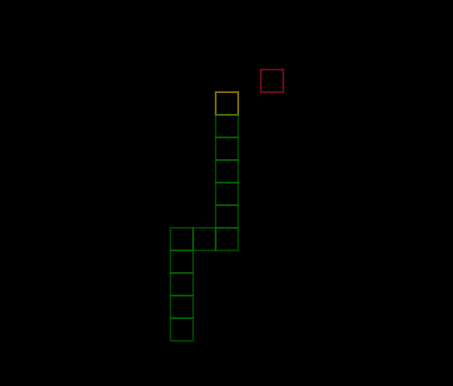

# SNAKE GAME
#### [deployed game](https://daniil-khlyvniuk.github.io/Snake/)

It is my first experience working with ``canvas``
The game doesn't have a gameOver, if you cross a border, the snake will appear on the other side. If you collide 
into tail, the snake will become smaller 

### Technology stack: 
1. HTML 5 (canvas)
2. vanilla js (ES6)

#### For start project just open ``index.html``

